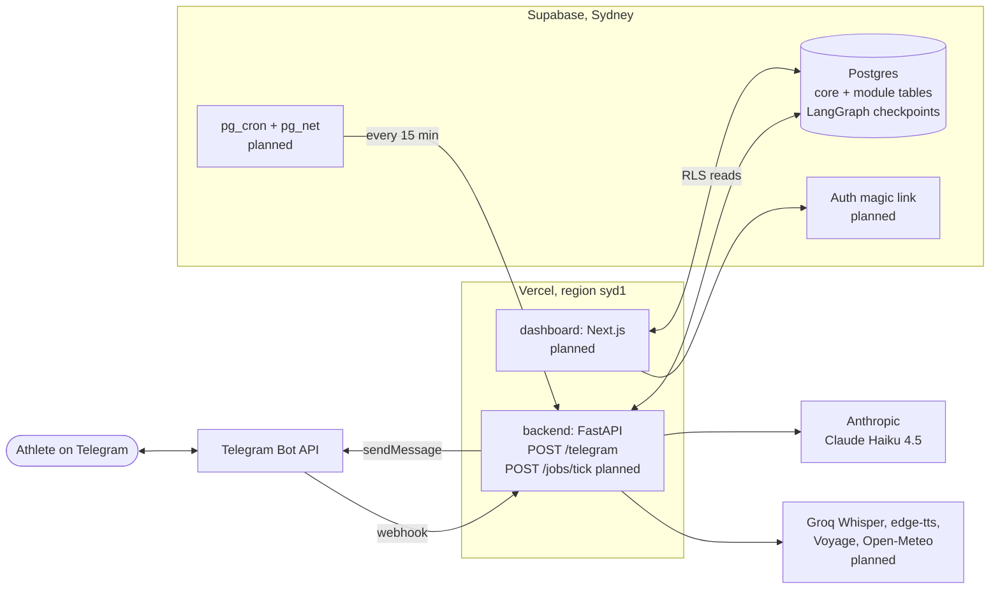
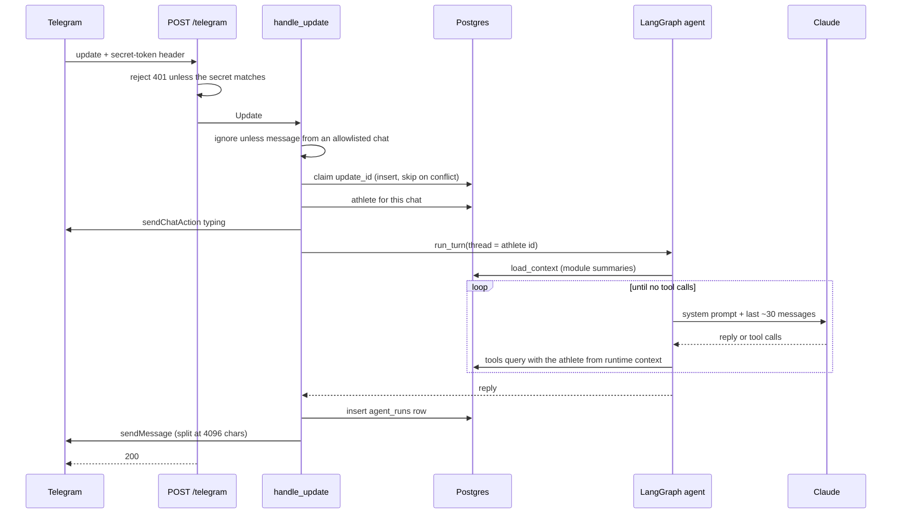

# Architecture

This document describes how Hybrid Athlete Coach is put together: the runtime pieces, how a request flows through them, where code lives, and the rules that keep it modular.
The product vision, schema details and build schedule live in [the project plan](Hybrid%20Athlete%20Coach%20%E2%80%94%20Project%20Plan.md).
Week-by-week implementation plans live in [`docs/superpowers/plans/`](docs/superpowers/plans/).

Sections marked **(planned)** describe later weeks; everything else is built in week 1.

## System context



There is no long-running server.
The backend is a Vercel Function that wakes for each webhook call or job tick, runs at most 300 seconds, and keeps all state in Postgres.

## Runtime pieces

| Piece | Where | Responsibility |
| --- | --- | --- |
| Telegram bot | Telegram | The only chat interface. Two bots: a dev bot for local long polling and a prod bot whose webhook points at Vercel. |
| Backend | `backend/`, Vercel project, Python 3.14 | Receives updates and job ticks, runs the agent, talks to every external API. |
| Agent | `coach.core.graph` | A LangGraph graph, `load_context -> agent <-> tools`, checkpointed in Postgres. |
| Database | Supabase Postgres | Facts in relational tables, fuzzy notes in pgvector, the agent thread in LangGraph's checkpoint tables, traces in `agent_runs`. |
| Scheduler **(planned, week 5)** | Supabase `pg_cron` + `pg_net` | POSTs `/jobs/tick` every 15 minutes; the backend decides which jobs are due. |
| Dashboard **(planned, week 7)** | `dashboard/`, separate Vercel project | Reads Supabase directly under RLS; public `/demo` on a synthetic athlete; real data behind a magic link. |

## Request flows

### A message turn



Rules this flow guarantees:

- The webhook answers 200 for every authenticated request, even when handling fails, so Telegram never retries a poisoned update. Failures are logged and recorded in `agent_runs.error`.
- A retried or concurrent delivery of the same `update_id` is processed once, enforced by the `processed_updates` primary key.
- If the model API fails, the athlete still gets a short fallback reply.
- Processing happens inside the request; at single-user volume a turn fits well within the 300-second limit.

### Local development

`coach poll` deletes the dev bot's webhook and long-polls `getUpdates`, passing each update to the same `handle_update`.
Only the transport differs between local and production.

### Scheduled jobs **(planned, week 5)**

`pg_cron` calls `POST /jobs/tick` with a `CRON_SECRET` header every 15 minutes.
The tick asks each module's jobs whether they are due in the athlete's local time, inserts a `job_runs` row keyed on (athlete, job, local date) before running, and skips the job if that row already exists.
Jobs run the agent with `trigger = 'schedule'` on the same thread as chat.

### Undo

Every log reply carries an inline Undo button whose callback data is `undo:<session id>`.
Tools put buttons there by appending to `CoachContext.reply_buttons`; the handler sends them under the last chunk of the reply.
A tap arrives as a `callback_query` update and goes through the same allowlist and `update_id` dedupe as messages.
The core deletes the `sessions` row only if it belongs to that athlete; module rows go with it through foreign keys (a gym program slot is freed because `program_sessions.completed_session_id` is `on delete set null`), so the core never knows module tables.
The athlete gets "Undone." and a chat line, and the same line is added to the thread so the agent knows.

### Confirmations **(planned, week 5)**

Program changes never block the conversation.
`propose_program_change` and `propose_exercise` write a pending row to `program_proposals`, send Yes/No inline buttons whose callback data carries the proposal id, and end the turn.
The button callback applies or declines the row in code and adds a note to the thread.
Proposals expire at the affected session's planned date.

LangGraph's `interrupt()` is used only for log blockers that are detected in code (today: an unknown surf spot).
`run_turn` checks the thread for a pending interrupt before each message: if there is one, the message resumes it as `{"text": ..., "location": {...} | None}` instead of starting a new turn, so it is never abandoned, and a Telegram location pin is a valid answer.
When a turn ends interrupted, the interrupt's `question` is the reply.
The interrupted tool runs again from the top on resume, so tools write nothing before they interrupt.

## Code map

```
backend/src/coach/
  main.py              FastAPI app; Vercel entrypoint coach.main:app
  cli.py               coach migrate | add-athlete | set-webhook | poll
  core/
    config.py          Settings from COACH_* env vars (secrets are SecretStr)
    db.py              psycopg async pool (autocommit, dict rows, no prepared statements)
    models.py          Athlete, AgentRun, ReplyButton
    migrations.py      runs core then module SQL files; enables RLS on every public table
    migrations/        core SQL
    repo.py            all SQL for core tables
    registry.py        DisciplineModule protocol, ScheduledJob, Registry, default_registry
    context.py         CoachContext: athlete, pool, registry, clock, http client, reply buttons, local_to_utc
    text.py            normalize and make_canonicalizer, shared by every module
    prompt.py          system prompt assembly
    tools.py           core tools (query_history)
    llm.py             the only place that names a model provider
    graph.py           CoachState, trim_history, build_graph
    turn.py            run_turn: one turn plus its agent_runs record
    telegram.py        Bot API client and update models
    deps.py            Deps and build_deps: everything a request needs
    handler.py         handle_update: allowlist, dedupe, turn, reply, Undo taps
    polling.py         local long polling
    evals.py           tool-call evals: live, record, replay (python -m coach.core.evals)
  modules/
    gym/
      module.py        GymModule: tools, prompt, context, evals
      library.py       exercise library and name matching (Portuguese names, English aliases)
      program.py       program file model and validation
      repo.py          gym SQL
      tools.py         get_program, log_gym_session
      seed.py          python -m coach.modules.gym.seed
      exercises.yaml   public library
      programs/        sample.yaml (public); real programs are private and git-ignored
      migrations/      gym SQL
      evals/           extraction.yaml + recordings/
    surf/
      module.py        SurfModule: tools, prompt, context, evals, canonical spot names
      spots.py         spot profiles; resolving names, aliases and typos
      forecast.py      Open-Meteo client; compass, wind relation, rating, tides, windows
      repo.py          surf SQL
      tools.py         log_surf_session (unknown spot -> location pin), get_surf_forecast, surf_history
      seed.py          python -m coach.modules.surf.seed
      spots.yaml       public spot profiles (edit, then re-seed)
      migrations/      surf SQL
      evals/           extraction.yaml + recordings/
    bjj/               planned, phase 2
dashboard/             planned, week 7
supabase/              local database config for development and CI
```

Dependencies point one way: `main` and `cli` depend on `core`; `core` never imports a module; modules depend on `core` and never on each other.

## Module system

A discipline is a folder under `coach/modules/` that implements `DisciplineModule`:

| Member | Purpose |
| --- | --- |
| `name` | Unique key, also the `disciplines` row and the migration owner. `core` is reserved. |
| `migrations` | Folder of SQL files, applied after core in filename order. |
| `tools()` | LangChain tools bound to the agent next to the core tools. |
| `prompt(athlete)` | System prompt fragment: vocabulary and rules for this sport. |
| `context(conn, athlete)` | A short summary of current state, joined into `load_context` each turn. |
| `jobs()` | Scheduled jobs with an `is_due(athlete, local_time)` check. |
| `evals()` | Public synthetic eval cases. |

Enabling a module means adding it to `default_registry()` in `registry.py` (a local import, because modules import from the core).
Modules can also put inline buttons under the reply through `CoachContext.reply_buttons`, call external APIs through `CoachContext.http` (a mock transport in tests), and offer an optional `canonical(name)` hook that eval scoring uses to compare names.
The `Registry` rejects duplicate module names and duplicate tool names at startup, and `build_graph` rejects a module tool that shadows a core tool.

Rules that keep "add a sport without touching the core" true:

- Modules never import each other. Cross-sport reasoning happens in the model, which sees every module's `context()` summary and every tool.
- Module migrations only add tables and reference core tables; they never alter core tables.
- Every module writes its sessions to the shared `sessions` table, with a details table of its own, so the core can see total load across sports.
- Modules never add cron entries; they declare jobs and the single tick runs them.

## Agent design

- **Graph:** `START -> load_context -> agent`, then `agent -> tools -> agent` while the model calls tools. Adding a module changes the tool list and the prompt, never the graph.
- **Runtime context:** the athlete, database pool, registry and clock reach nodes and tools through LangGraph's runtime context (`CoachContext`), never through model-generated arguments. A tool cannot query another athlete's data.
- **Memory:** one checkpointer thread per athlete, keyed on the athlete id and kept forever. Each model call sees the system prompt plus the last ~30 messages, cut so that a tool call never loses its result. Messages that fall out of the window are removed from the checkpoint so storage stays bounded. Long-term facts come from Postgres through tools and `load_context`, not from chat history.
- **Model:** Claude Haiku 4.5 through `get_chat_model`; swapping providers touches only `llm.py`. Sonnet 5.5 is used only as the eval judge.
- **Tool results** are JSON strings built from SQL rows. Invalid tool arguments come back to the model as tool errors rather than failing the turn.

## Data

Facts live in relational tables and are queried with SQL; only fuzzy text (technique notes, reflections) gets embeddings.
The full schema is in the project plan; the core tables are:

| Table | Holds |
| --- | --- |
| `disciplines` | One row per installed module. |
| `athletes` | Profile, time zone, Telegram chat id, Supabase Auth user id. |
| `sessions` | One row per training session in any sport. |
| `readiness_checkins` | Soreness and energy by body area. |
| `notes` | Notes with `vector(1024)` embeddings. |
| `agent_runs` | Every turn: input, tool calls, output, tokens, latency, error. |
| `processed_updates` | Telegram update ids already handled. |
| `job_runs` | Scheduled job runs, one per (athlete, job, local date). |
| `eval_cases`, `eval_runs` | Private real eval cases; results of every eval run. |
| `coach_migrations` | Which migration files have run. |
| `checkpoints`, `checkpoint_*` | LangGraph's thread state. |

The gym module adds:

| Table | Holds |
| --- | --- |
| `exercises` | The library per athlete: name, aliases, pattern, equipment, load areas. |
| `programs` | Seeded programs; at most one active per athlete. |
| `program_sessions` | The ordered sequence; a session is pending until a logged session completes it or it is skipped. |
| `program_exercises` | Each session's prescriptions: block (prep or main), sets, reps, rest, tempo, notes. |
| `gym_details` | Per logged session: the program session it completed and the main lifts with any loads, swaps and skips. |

The surf module adds:

| Table | Holds |
| --- | --- |
| `surf_spots` | The athlete's spots: name, aliases, coordinates, favourite, and a profile (swell directions it works with, offshore wind directions, minimum swell). |
| `surf_details` | Per logged session: spot, wave heights in feet, wind, tide, waves caught, board, notes. |

Surf forecasts come from Open-Meteo's regional model, so nearby spots share the same swell and tide numbers; each spot's profile turns them into a 0 to 5 rating per morning, midday and afternoon, and every answer is labelled an estimate.

Migrations are plain SQL files run by `coach migrate`, recorded in `coach_migrations`, each applied in its own transaction.
Time-based questions ("this week", "last week") use calendar weeks that start Monday 00:00 in the athlete's time zone, never UTC, and session times are reported in local time with their weekday.

## Security

- **Who can talk to the bot:** only chat ids in `COACH_TELEGRAM_ALLOWED_CHAT_IDS` that are linked to an athlete; everything else is ignored without a reply.
- **Webhook authenticity:** Telegram sends the secret set with `setWebhook` in `X-Telegram-Bot-Api-Secret-Token`; it is compared in constant time. `/jobs/tick` will use a separate `CRON_SECRET`.
- **Row-level security:** enabled on every table in `public`, including the checkpoint tables, because Supabase exposes `public` over its REST API. The backend connects as the database owner and bypasses RLS; the dashboard reads as one authenticated athlete with select-only policies.
- **Secrets:** loaded from `COACH_*` environment variables into `SecretStr`, never logged. Telegram URLs contain the bot token, so httpx request logging is kept at WARNING.
- **Personal data:** real transcripts and eval cases stay in private tables; the public repo ships only synthetic eval data. Free-tier model APIs are used only with synthetic data.

## Deployment and configuration

| Setting | Value |
| --- | --- |
| Backend | Vercel project with root directory `backend/`, entrypoint `coach.main:app`, region `syd1`, Hobby plan |
| Dashboard | Separate Vercel project with root directory `dashboard/` **(planned)** |
| Database | Supabase in `ap-southeast-2`; the backend uses the transaction pooler (port 6543) |
| Python | 3.14, dependencies locked with uv; nothing newer than 7 days is resolved |
| Model spend | Anthropic monthly limit of $10 |

Environment variables (`backend/.env.example` lists them):

| Variable | Meaning |
| --- | --- |
| `COACH_DATABASE_URL` | Postgres connection string |
| `COACH_TELEGRAM_BOT_TOKEN` | Dev bot locally, prod bot on Vercel |
| `COACH_TELEGRAM_WEBHOOK_SECRET` | Shared secret for the webhook header |
| `COACH_TELEGRAM_ALLOWED_CHAT_IDS` | JSON list of chat ids |
| `COACH_ANTHROPIC_API_KEY` | Claude access |
| `COACH_AGENT_MODEL` | Defaults to `claude-haiku-4-5-20251001` |

## Testing and quality

- Tests run against a real local Supabase Postgres (`supabase db start`), the same image as production, so RLS, `auth.uid()` and pgvector behave the same. Tests that need isolation run inside a rolled-back transaction; the rest use fresh athletes.
- The model is replaced by a scripted fake that records every prompt it receives; the Telegram API is replaced by an httpx mock transport. No test touches the network.
- Every commit passes ruff, ruff format, mypy (strict) and pytest, enforced by pre-commit and by GitHub Actions.
- Evals: each module lists YAML eval sets of messages and the tool arguments they should produce. `python -m coach.core.evals --mode live --record` asks Claude once per case and records the answers next to the set; CI replays the recordings at no cost. Scores are field-level precision and recall plus invented fields; `--save-run` writes them to `eval_runs`. Private real cases and scheduled live runs come later.

## Observability

Every turn writes one `agent_runs` row: trigger, input, each tool call with its owning module, arguments, status and a result summary, the reply, model, token counts, latency and any error.
This table is the trace store; the dashboard's trace viewer reads it, and LangSmith is optional for local debugging only.
